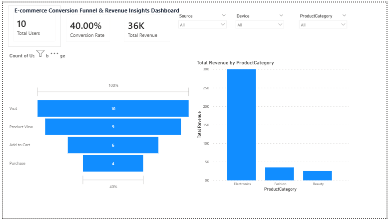
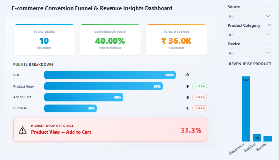

# E-commerce Conversion Funnel Dashboard

## Overview

This project analyzes user behavior across an e-commerce funnel to identify drop-off points and improve conversion rates. The dashboard is designed with a focus on both data analysis and product thinking.

---

## Dashboard Comparison

### Before



### After



---

## Problem

In e-commerce platforms, users often drop off before completing a purchase. It is important to identify:

* Where users are leaving the funnel
* Which stage impacts conversion the most
* How user behavior affects revenue

---

## Objective

To build a dashboard that highlights conversion bottlenecks and supports data-driven decision making.

---

## Dashboard Features

* Funnel analysis from Visit to Purchase
* Stage-wise drop-off percentage
* Conversion rate tracking
* Revenue analysis by product category
* Segmentation by Source and Device
* Interactive slicers for dynamic filtering

---

## Key Insights

* Highest drop-off of around 33% occurs between Product View and Add to Cart
* Mid-funnel stages contribute most to conversion loss
* Electronics category generates the highest revenue
* User behavior varies across sources and devices

---

## Business Recommendations

* Improve Add-to-Cart experience and CTA visibility
* Optimize product page design and trust elements
* Enhance mobile user experience
* Retarget users dropping off in mid-funnel

---

## Important DAX Measures

### Total Users

```DAX
Total Users = DISTINCTCOUNT(EcommerceData[UserID])
```

### Total Revenue

```DAX
Total Revenue = SUM(EcommerceData[Revenue])
```

### Total Purchases

```DAX
Total Purchases =
CALCULATE(
    DISTINCTCOUNT(EcommerceData[UserID]),
    EcommerceData[Stage] = "Purchase"
)
```

### Conversion Rate

```DAX
Conversion Rate =
DIVIDE([Total Purchases], [Total Users], 0)
```

### Drop Off %

```DAX
Drop Off % =
VAR CurrentStage = SELECTEDVALUE(EcommerceData[StageOrder])

VAR CurrentUsers =
    CALCULATE(
        DISTINCTCOUNT(EcommerceData[UserID]),
        FILTER(ALL(EcommerceData), EcommerceData[StageOrder] = CurrentStage)
    )

VAR NextUsers =
    CALCULATE(
        DISTINCTCOUNT(EcommerceData[UserID]),
        FILTER(ALL(EcommerceData), EcommerceData[StageOrder] = CurrentStage + 1)
    )

RETURN
IF(
    ISBLANK(CurrentStage) || ISBLANK(NextUsers),
    BLANK(),
    1 - DIVIDE(NextUsers, CurrentUsers)
)
```

---

## Project Files

* Ecommerce_Funnel_Dashboard.pbix → Power BI dashboard file

---

## Tools Used

* Power BI
* DAX

---

## Outcome

Developed a structured dashboard that identifies conversion issues and supports business decisions with clear, actionable insights.
